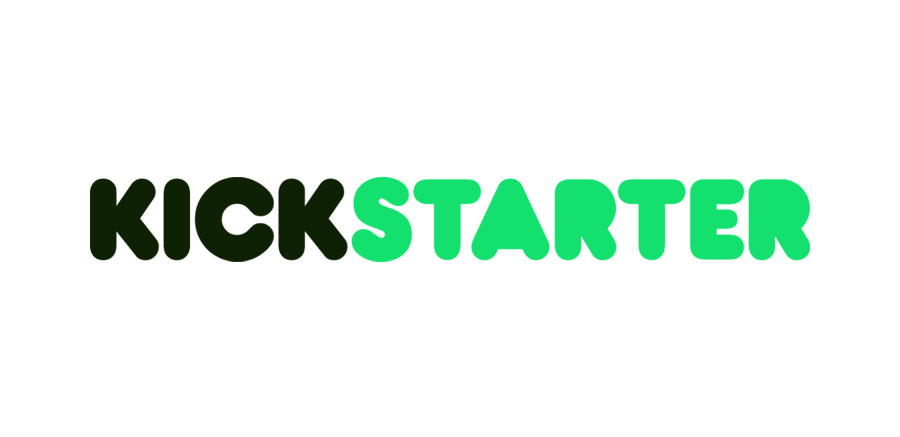

# Kickstarter-Analysis

## Table of Contents
- [Analysis on Launch Date](https://github.com/Jenny16x/Kickstarter-Analysis#Analysis-of-Outcomes-Based-on-Launch-Date)
- [Analysis on Goals](https://github.com/Jenny16x/Kickstarter-Analysis#Analysis-of-Outcomes-Based-on-Goals)
- [Challenges and Difficulties](https://github.com/Jenny16x/Kickstarter-Analysis#Challenges-and-Difficulties-Encountered)
- [Results](https://github.com/Jenny16x/Kickstarter-Analysis#Results)

## Analysis of Outcomes Based on Launch Date

### Analysis
The outcomes based on the launch date did show that successful rate is higher on certain months throughout the years. The biggest spike in the outcomes in during the month of June. December had the least successful outcomes.  

[*jump to top*](https://github.com/Jenny16x/Kickstarter-Analysis#Kickstarter-Analysis)

 

## Analysis of Outcomes Based on Goals

### The success rate shows that the lower the goal, the higher the success rate is.

[*jump to top*](https://github.com/Jenny16x/Kickstarter-Analysis#Kickstarter-Analysis)

 

## Challenges and Difficulties Encountered

### The most challenging part for me was when I did not know how to use the excel magic and copied and paste a lot of the formulas and that caused a lot of typos and I kind of went down the rabbit hole trying to find out why my numbers were coming back different.

[*jump to top*](https://github.com/Jenny16x/Kickstarter-Analysis#Kickstarter-Analysis)

 

## Results

### The highest success rate is during the month of June and lowest is the month of December based on the launch date from all previous events. I conclude that Louise had set too high of goal amounts which lead to high failed outcomes.

 

[*jump to top*](https://github.com/Jenny16x/Kickstarter-Analysis#Kickstarter-Analysis)